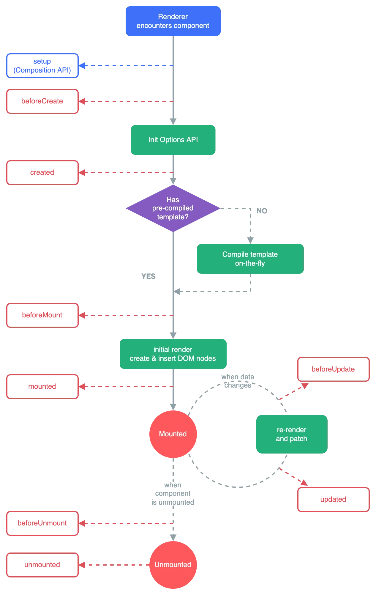

## Composition API

Composition API는 `data`, `methods` 등 옵션을 선언하는 대신, `ref`, `onMounted` 등 가져온 함수를 사용하여 Vue 컴포넌트를 작성할 수 있는 API 세트이다.

Composition API 내부에서 사용되는 각각의 API들은 다음 세 가지 주요 분류로 나눌 수 있다.

---

### 반응형 API (Reactivity API)

`ref()`, `reactive()` 등의 API를 통해 다음과 같은 기능을 구현할 수 있다.

- 반응 상태 (Reactive State)
- 계산된 상태 (Computed State)
- 감시자 (Watchers)

예시:

```js
<template>
	<div>
		<h2>반응형</h2>
		<p>{{ reactiveMessage }}</p>
		<button v-on:click="addReactiveMesssage">Add message</button>
		<h2>일반</h2>
		<p>{{ normalMessage }}</p>
		<button v-on:click="addNormalMesssage">Add message</button>
	</div>
</template>

<script>
import { isRef, onUpdated, ref } from 'vue';

export default {
	setup() {
		// 반응형 상태 선언
		const reactiveMessage = ref('Reactive Message');
		// 일반 변수 선언
		let normalMessage = 'Normal Message';

		console.log('isRef(reactiveMessage): ', isRef(reactiveMessage)); // true
		console.log('isRef(normalMessage): ', isRef(normalMessage)); // false

		const addReactiveMesssage = () => {
			reactiveMessage.value = reactiveMessage.value + '!';
		};
		const addNormalMesssage = () => {
			normalMessage = normalMessage + '!';
		};

		onUpdated(() => {
			console.log('update component');
		});

		return {
			reactiveMessage,
			normalMessage,
			addReactiveMesssage,
			addNormalMesssage,
		};
	},
};
</script>

<style lang="scss" scoped></style>
```

---

### 라이프사이클 훅 (Lifecycle Hooks)
> **라이프 사이클**: Vue 인스턴으나 컴포넌트가 생성될 때 미리 사전에 정의 된 몇 단계의 과정

라이프사이클 훅을 사용하면 컴포넌트의 특정 생명주기 시점에 코드를 삽입할 수 있다.  
예를 들어 `onMounted()`, `onUnmounted()` 등을 통해 컴포넌트가 mount되거나 unmount될 때 동작을 정의할 수 있다.  
참고 [Lifecycle Hooks 문서](https://vuejs.org/guide/essentials/lifecycle.html#lifecycle-diagram)

create → mount → update → destroy
<details>
  <summary> 라이프 사이클 다이어그램</summary>

  <br/>

  

</details>


---

### 종속성 주입 (Dependency Injection)
Vue에서는 `provide()`와 `inject()`를 사용하여 컴포넌트 간 의존성을 주입할 수 있다.
Compositon API에서는 이 기능을 더욱 명확하게 사용할 수 있으며, 반응형 상태와 함께 사용할 수 있다.
```js
// 부모 컴포넌트
provide('key', ref('value'));

// 자식 컴포넌트
const injected = inject('key');
```
