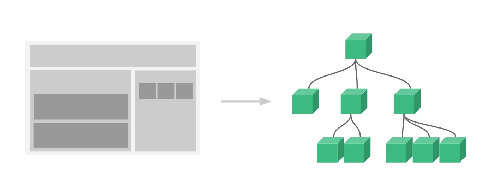

# 컴포넌트 이해

## 컴포넌트 만들기
>정의 → 등록 → 사용


## 컴포넌트 정의
컴포넌트 <U>어떤 방법으로 정의</U>하느냐에 따라 *문자열 템플릿*, *Single File Component* 두 가지 방법이 있다.
   
### 문자열 템플릿 (string template)
```js
// BookComponent.js 파일
export default {
  data() {
    return {
      subtitle: '도서명'
    }
  },
  template: `
    <article class="book">
      <div class="book__subtitle">{{ subtitle }}</div>
      <div class="book__title">
        HTML 강좌
      </div>
    </article>
  `
}
```
   
### Single File Component (SFC)
자바스크립트로 복잡한 프로젝트를 개발한다면 다음과 같은 어려움이 존재한다.
* *문자열 템플릿*은 가독성이 떨어지고 예쁘지 않다.
* `.js`는 HTML과 JavaScript는 모듈화 할 수 있지만 CSS는 빠져있다.
   
이 모든 문제를 해결하기 위해 Vue.js는 WebPack, Browserify, Vite와 같은 빌드 도구를 활용하여 `.vue`확장자를 가진 *Single File Component*를 사용한다.
SFC는 `template`, `script`, `style` 크게 세 가지로 구성되어 있다.

```js
// BookComponent.vue 파일
<template>
  <article class="book">
    <div class="book__subtitle">{{ subtitle }}</div>
    <div class="book__title">
      HTML 강좌
    </div>
  </article>  
</template>

<script>
export default {
  data() {
    return {
      subtitle: '도서명'
    }
  },
}
</script>

<style scoped>
</style>
```
> 실무에서는 주로 `SFC`를 사용한다.
## 컴포넌트 등록
컴포넌트를 <U>어디에서 사용하냐</U>에 따라 두 가지 등록 방법이 있다.
* *전역등록 (Global registration)*   
`app.component`를 이용해서 컴포넌트를 등록하면, 컴포넌트는 애플리케이션 *전역 등록*이 되어 모든 컴포넌트 인스턴스의 템플릿 내부에서 사용할 수 있다.   
  >const app = createApp({ ... })
app.component('BookComponent', BookComponent)
* *지역 등록 (Local Registration)*   
전역 등록은 보통 이상적이지 않다. WebPack과 같은 빌드 시스템을 사용하는 경우 컴포넌트를 전역 등록 하게 되면 컴포넌트를 사용하지 않더라도 계속해서 최종 빌드에 해당 컴포넌트가 포함된다. 이는 사용자가 다운로드하는 JS 파일의 크기를 증가시킨다.
  
  Vue 인스턴스의 `components` 속성 안에 정의하면 해당 Vue 인스턴스에서 지역 등록된 컴포넌트를 사용할 수 있다.
  >const app = createApp({
	components: {
		BookComponent: BookComponent
	}
})
## 컴포넌트 사용
컴포넌트는 `template`에서 사용할 수 있다.
```
<BookComponent></BookComponent>
<book-component></book-component> 
```
* `PascalCase`로 등록된 컴포넌트는 `PascalCase`, `kebab-cased` 둘 다 사용가능 하다.
* `kebab-cased`로 등록된 컴포넌트는 `kebab-cased`로만 사용가능하다.

#### 컴포넌트 네이밍 룰
컴포넌트를 사용할 때 `PascalCase`를 권장한다.   
>Pascal 이점: PascalCased 이름은 유효한 JavaScript 식별자이다. 이렇게 하면 JavaScript에서 구성 요소를 더 쉽게 가져오고 등록할 수 있습다. IDE의 자동 완성 기능도 지원한다.
  
## 컴포넌트 시스템
컴포넌트 시스템은 작고 독립적이며 재사용할 수 있는 컴포넌트로 구성된 대규모 애플리케이션을 구축할 수 있게 해주는 추상적 개념이다.
* 작은 의미 재사용 가능한 컴포넌트
* 넓은 의미 모든  Vue 인스턴스는 컴포넌트이다.

